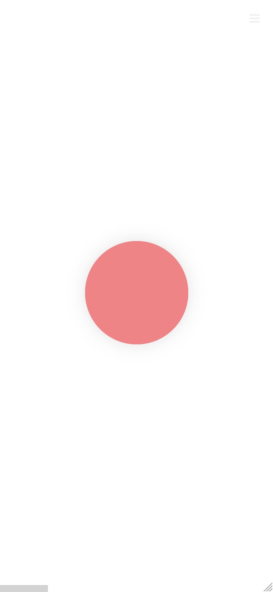
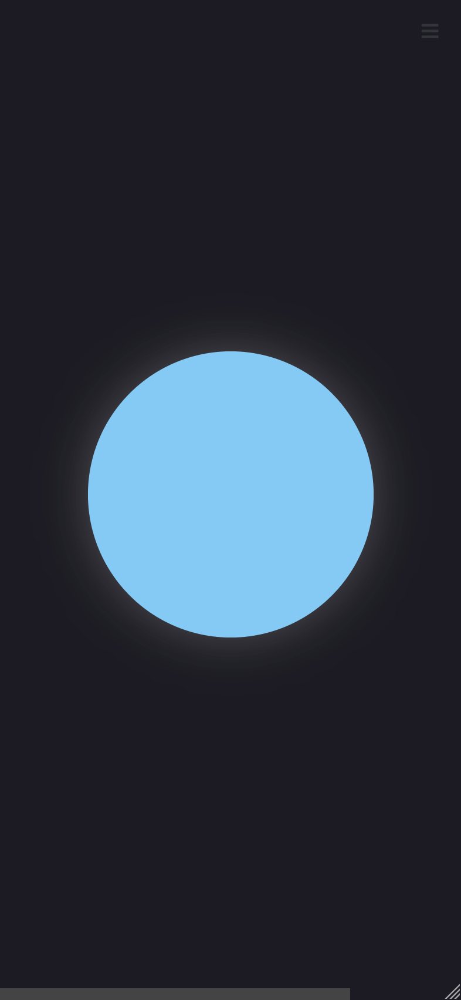
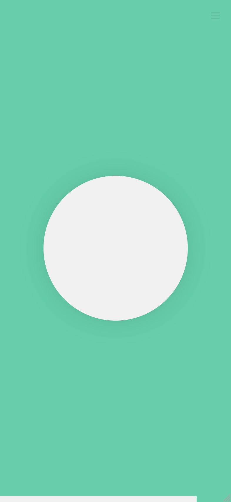

# Breather

A simple breathing exercise visualization.

## Screenshots

<p align="center">
  
  
  
</p>

## Usage

[https://www.tonipenya.com/breather/?breath_duration_s=5&session_duration_m=5](https://www.tonipenya.com/breather/?breath_duration_s=5&session_duration_m=5).

### Query parameters

-   `breath_duration_s`: Duration of the inhale/exhale cycle. In seconds.
-   `session_duration_m`: Total session duration. In minutes.
-   `autoplay`: Whether to start the timer on page load or require user touch/click.
-   `theme`: Theme selection. ("light", "dark", "green").

## Theming

Add a `:root[data-theme="your_theme_name"]` ruleset with overrides over the default light/dark themes.

E.g.

```css
:root[data-theme="sunset"] {
    --color-in: #ffd66b;
    --color-out: #ff6b4a;
    --color-progress: #ffd66b;
    background: #ffb97b;
    color-scheme: light;
}
```
